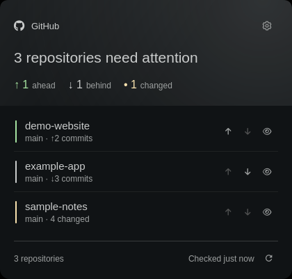

# Foamy GitHub

Local Git repository status, fetch, push, and pull.



## Install

```sh
omarchy plugin add https://github.com/foamrider/foamy-github.git --enable
```

## Use

1. Left-click the widget, open the cog, and add your repository folders.
2. Choose the folder search depth, refresh intervals, and language.
3. Use refresh (or middle-click the widget) to fetch remotes and update status.
4. Use a repository's arrows to push or pull, or its eye button to open lazygit.

**Detect changes automatically (Recommended)** is enabled by default. Local
changes update through filesystem notifications. Changes saved close together
are grouped over 300 ms. Only affected repositories are checked. Ignored
dependency/build directories and Git object stores are excluded from monitoring;
Git worktrees and newly created repositories within the configured scan depth
are supported. Remote fetching still uses its separate timer.

If monitoring fails (for example, the system watch limit is reached), the panel
reports it and uses **Fallback interval** until monitoring recovers. Turning off
automatic change detection stops the watcher and relabels that setting to
**Interval**, which controls regular polling. **Disabled** turns off polling in
either mode; automatic change detection still works when enabled. Opening the
panel or completing a Git action still refreshes status, and the remote fetch
schedule remains separate. No extra package is required.

Uses your existing Git authentication. Pull requires a clean, non-diverged
branch with an upstream and uses fast-forward only. Works with any Git host.

## License

Licensed under [MIT](LICENSE), with [Omarchy](LICENSE-OMARCHY) and
[Lucide](LICENSE-LUCIDE) notices.

Provided **as is**, without warranty or guaranteed support. Use at your own risk.
