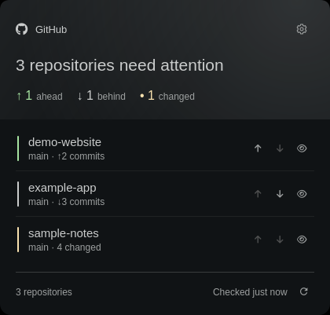

# Foamy GitHub

Local Git repository status, fetch, push, and pull.



## Install

Requires Omarchy Quattro, Git, Python 3, Bash, and `jq`. Opening a repository
from the eye button also requires `lazygit` and Omarchy's terminal launcher.

```sh
omarchy plugin add https://github.com/foamrider/foamy-github.git --enable
```

## Use

1. Left-click the widget, open the cog, and add your repository folders.
2. Choose the folder search depth, refresh intervals, and language.
3. Use refresh (or middle-click the widget) to fetch remotes and update status.
4. Use a repository's arrows to push or pull, or its eye button to open lazygit.

**Detect changes automatically (Recommended)** is enabled by default. Local
changes update through filesystem notifications. Changes saved close together
are grouped over 300 ms. Only affected repositories are checked. Ignored
dependency/build directories and Git object stores are excluded from monitoring;
Git worktrees and newly created repositories within the configured scan depth
are supported. Remote fetching still uses its separate timer.

If monitoring fails (for example, the system watch limit is reached), the panel
reports it and uses **Fallback interval** until monitoring recovers. Turning off
automatic change detection stops the watcher and relabels that setting to
**Interval**, which controls regular polling. **Disabled** turns off polling in
either mode; automatic change detection still works when enabled. Opening the
panel or completing a Git action still refreshes status, and the remote fetch
schedule remains separate. No extra package is required.

Uses your existing Git authentication. Pull requires a clean, non-diverged
branch with an upstream and uses fast-forward only. Works with any Git host.

Repository checks stream Git status without retaining file lists. Completed
checks show exact Git status entry counts (untracked directories count as one
entry). A timeout, resource limit, or Git error shows **Status unavailable** for
that repository and disables push/pull until a fresh check succeeds. Other
repositories continue to update. An incomplete folder scan reports an error;
it never silently lists a subset as a successful scan.

To keep background work bounded, checks allow 16 MiB of Git output and 15 seconds
per status command, with at most four commands running concurrently per helper.
Folder discovery allows 256 repositories and 100,000 directory entries within
five seconds per traversal. Monitoring allows 8,192 watches and 32,768
repository-to-directory associations. Oversized monitoring plans use the normal
fallback interval; choose narrower folders, reduce scan depth, or disable
automatic detection if a limit persists. Shell messages and cached sync state
are limited to 8 MiB. These limits bound plugin buffers and work; Git itself
still needs memory to inspect its index.

## Remove

```sh
omarchy plugin remove foamy.github
```

Removal stops repository monitoring and scheduled fetches. Your repositories,
Git configuration, authentication, and cached status remain on disk.

Omarchy manages the plugin entry in `shell.json`. Packages and data outside
the plugin directory are retained unless you remove them separately.

## License

Licensed under [MIT](LICENSE), with [Omarchy](LICENSE-OMARCHY) and
[Lucide](LICENSE-LUCIDE) notices.

Provided **as is**, without warranty or guaranteed support. Use at your own risk.
